<div align="center">

# OpenSIN-Skills

### The World's Largest Open-Source AI Agent Skill Library

**280+ Skills** | **9 Expertise Domains** | **8 Operations Categories** | **9 Personas** | **8 Orchestration Patterns**

[](LICENSE)
[](#skill-catalog)
[](#python-tools)
[](#installation)

---

*What if your AI agent had the expertise of a Senior Architect, the creativity of a CMO,*
*AND the automation power to deploy infrastructure, generate media, and orchestrate entire coding teams?*

</div>

---

## Architecture

```mermaid
graph TB
    subgraph "Knowledge Layer (235 Skills)"
        ENG[Engineering<br/>50+ skills]
        PROD[Product<br/>30+ skills]
        MKT[Marketing<br/>25+ skills]
        CLVL[C-Level<br/>20+ skills]
        PM[Project Mgmt<br/>25+ skills]
        QM[RA/QM<br/>30+ skills]
        BIZ[Business Growth<br/>20+ skills]
        FIN[Finance<br/>15+ skills]
    end

    subgraph "Action Layer (47 Skills)"
        A2A[Agent Creation<br/>11 skills]
        BROWSER[Browser Automation<br/>5 skills]
        DEPLOY[Deployment<br/>2 skills]
        MEDIA[Media Generation<br/>10 skills]
        PLAN[Planning<br/>6 skills]
        DOCS[Documents<br/>4 skills]
    end

    subgraph "Orchestration"
        PERS[9 Personas]
        ORCH[8 Patterns]
    end

    ENG --> BRAIN((Agent Brain))
    PROD --> BRAIN
    MKT --> BRAIN
    CLVL --> BRAIN
    PM --> BRAIN
    QM --> BRAIN
    BIZ --> BRAIN
    FIN --> BRAIN
    A2A --> BRAIN
    BROWSER --> BRAIN
    DEPLOY --> BRAIN
    MEDIA --> BRAIN
    PLAN --> BRAIN
    DOCS --> BRAIN
    PERS --> BRAIN
    ORCH --> BRAIN

    style BRAIN fill:#00ff41,stroke:#333,stroke-width:3px,color:#000
```



## Two Systems, One Brain

| Layer | Source | Count | Purpose |
|-------|--------|-------|---------|
| **Knowledge** | [claude-skills](https://github.com/alirezarezvani/claude-skills) by Alireza Rezvani | 235 | How to think, decide, plan |
| **Action** | OpenSIN-AI | 47 | How to execute, automate, deploy |
| **Personas** | Combined | 9 | Role-based agent identities |
| **Orchestration** | Combined | 8 | Multi-skill coordination patterns |

## Quick Start

```bash
# Clone the library
git clone https://github.com/OpenSIN-AI/OpenSIN-Skills.git
cd OpenSIN-Skills

# No package install required
# The repository is script-first and validates via stdlib Python tooling

# Validate repository baseline (profile-aware)
python3 scripts/validate-skill.py --all .

# Enforce full OpenSIN canonical metadata for strict rollout work
python3 scripts/validate-skill.py --all . --strict

# Generate skill catalog
python3 scripts/catalog-generator.py . --output catalog.json --stats
```

## Governance & Operations

OpenSIN-Skills ships with the canonical governance pack for OpenSIN repositories:

- `governance/repo-governance.json` — policy-as-code baseline
- `governance/pr-watcher.json` — PR watcher contract
- `platforms/registry.json` — inbound platform registry
- `n8n-workflows/inbound-intake.json` — canonical intake workflow
- `docs/03_ops/inbound-intake.md` — operator guide
- `scripts/watch-pr-feedback.sh` — PR watcher runtime
- `.github/` — CODEOWNERS, issue forms, PR template, OCI-dispatch CI

CI/CD follows the org-standard pattern: GitHub events dispatch into the OCI / n8n control plane via `OpenSIN-AI/sin-github-action` instead of long-running GitHub-hosted jobs.

## Skill Domains

### Knowledge Skills (from claude-skills)

| Domain | Skills | Description |
|--------|--------|-------------|
| `engineering/` | 50+ | Software architecture, system design, code review, testing, DevOps |
| `product-team/` | 30+ | Product strategy, user research, roadmapping, analytics |
| `marketing-skill/` | 25+ | Content strategy, SEO, growth, brand, social media |
| `c-level-advisor/` | 20+ | CEO, CTO, CFO, COO advisory and decision frameworks |
| `project-management/` | 25+ | Agile, Scrum, risk management, stakeholder communication |
| `ra-qm-team/` | 30+ | Regulatory affairs, quality management, compliance, audits |
| `business-growth/` | 20+ | Market analysis, partnerships, scaling, internationalization |
| `finance/` | 15+ | Financial planning, budgeting, forecasting, investor relations |

### Operational Skills (OpenSIN native)

| Category | Skills | Description |
|----------|--------|-------------|
| `operations/agent-creation/` | 11 | Create A2A agents, Telegram bots, auth plugins, HF Spaces |
| `operations/browser-automation/` | 5 | Stealth browsing, crash testing, web verification |
| `operations/deployment/` | 2 | Cloudflare Workers, Vercel deployment |
| `operations/media/` | 10 | Image generation, video (Sora), 3D (NVIDIA), thumbnails |
| `operations/planning/` | 6 | Enterprise planning, debugging, parallel exploration |
| `operations/documents/` | 4 | PDF, DOCX, visual repos, design systems |
| `operations/google/` | 2 | Google account management |
| `operations/misc/` | 6 | Preview, self-healing, SEO, governance, research |

## Skill Authoring Standard

Every skill follows our **13-pattern standard**:

1. **Context-First Design** — YAML frontmatter with metadata
2. **Practitioner Voice** — Write as an expert, not a textbook
3. **Multi-Mode Workflows** — Build + Optimize (minimum)
4. **Related Skills Navigation** — Cross-references between skills
5. **Reference Separation** — Keep refs in separate files
6. **Proactive Triggers** — When to activate this skill
7. **Output Artifacts** — What the skill produces
8. **Quality Loop** — Self-review checklist
9. **Communication Standard** — Clear formatting
10. **Python Tools** — stdlib-only, --help support
11. **A2A Integration** (OpenSIN) — Agent fleet connectivity
12. **MCP Tooling** (OpenSIN) — Model Context Protocol tools
13. **Fleet Dispatch** (OpenSIN) — HF VM coder delegation

Patterns 1-10 from [claude-skills](https://github.com/alirezarezvani/claude-skills) by Alireza Rezvani.
Patterns 11-13 by OpenSIN-AI.

See [SKILL-AUTHORING-STANDARD.md](SKILL-AUTHORING-STANDARD.md) for full details.

## Python Tools

All Python scripts are **stdlib-only** (zero pip installs):

```bash
# Export profile-aware validation results
python3 scripts/validate-skill.py --all . --json

# Enforce canonical OpenSIN metadata everywhere
python3 scripts/validate-skill.py --all . --strict

# Generate catalog
python3 scripts/catalog-generator.py . --output catalog.json
```

## Integration

Works with: **OpenCode** | **Cursor** | **Aider** | **Windsurf** | **Kilo Code** | **Augment**

## Credits

- **Alireza Rezvani** — Creator of [claude-skills](https://github.com/alirezarezvani/claude-skills) (235 expertise skills, MIT License)
- **OpenSIN-AI** — 47 operational skills, A2A integration, fleet dispatch patterns

## License

[MIT](LICENSE) — Use freely. Credit appreciated.
