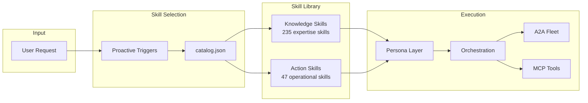

# OpenSIN-Skills Architecture

## System Overview

## Skill Categories

### Knowledge Layer (claude-skills upstream)
Expertise skills that teach AI agents HOW TO THINK about domain problems.
Imported from [claude-skills](https://github.com/alirezarezvani/claude-skills) by Alireza Rezvani.

### Action Layer (OpenSIN native)
Operational skills that give AI agents the power to EXECUTE real-world tasks:
agent creation, browser automation, deployment, media generation, planning.

### Persona Layer
Role-based identities that combine multiple skills into coherent expert personalities.

### Orchestration Layer
Patterns for coordinating multiple skills and agents on complex tasks.

## Integration Points

- **OpenCode CLI**: Primary skill loading mechanism
- **A2A Agents**: Skill-powered autonomous agents
- **MCP Servers**: Tool exposure via Model Context Protocol
- **Fleet Dispatch**: Delegating work to HF VM coders via SIN-Hermes
