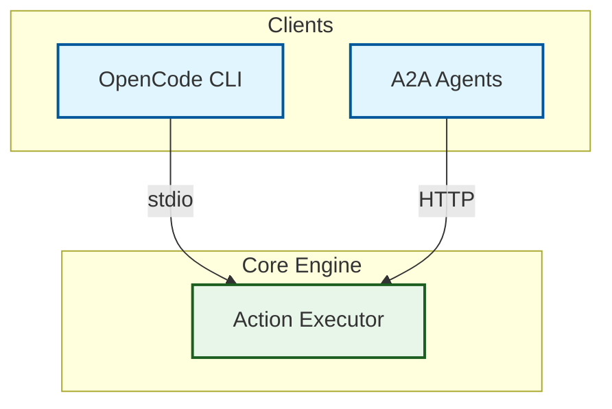

> OpenCode SSOT v2.0 - Enterprise Visual Standard. Erstellt nach dem Simone-MCP Erfolgspattern. Macht JEDES Repo visuell verständlich, AI-discoverable, und professionell - für Developer UND Nicht-Developer.

# /visual-repo Skill v2.0 (Enterprise)

**Transformiere jedes Repository in ein visuelles Meisterwerk das auf den ersten Blick verständlich, AI-discoverable, und professionell ist.**

---

## 🚨 TRIGGER (WANN DIESEN SKILL NUTZEN)

**Keywords:** "visual repo", "diagramme", "mermaid", "infografik", "readme verbessern", "repo visualisieren", "architektur diagramm", "was macht das projekt", "besser erklären", "nutzerfreundlich", "verkaufen", "landing page", "hook", "benefits zeigen", "action zeigen", "optisch vorstellen", "quereinsteiger", "nicht-developer", "bilder sagen mehr als tausend worte", "llms.txt", "social preview", "badges", "contributing", "security"

**PFLICHT-AUSLÖSER:**
- `/sovereign-repo-governance` → IMMER `/visual-repo` mitverwenden!
- Neues Repo erstellt
- Bestehendes Repo mit schlechter README-Doku
- "Ich verstehe nicht was das macht"
- Repo visuell aufwerten
- AI-Discoverability verbessern
- Professionalisierung needed

---

## 🧠 DAS PROBLEM

95% aller GitHub Repos werden von Nicht-Developern nicht verstanden. Bilder sagen mehr als tausend Worte. Wir brauchen ZWEI Ebenen:
1. **Developer:** Mermaid-Diagramme, Architektur-Flows, technische Tiefe
2. **Nutzer:** Infografiken, Nutzen-Versprechen, "Was bringt mir das?"

---

## 🎯 DIE GOLDENE REGEL: 3-Sekunden-Hook

**NIEMALS das Feature verkaufen (was es ist). IMMER das Ergebnis verkaufen (was es für mich tut).**

```
Problem → Nutzen → Einfachheit → Preis → Visualisierung
```

---

## 🏗️ REPO-TYP-ERKENNUNG (Punkt 24)

**BEVOR du startest: Repo-Typ bestimmen! Jeder Typ hat andere Prioritäten.**

| Repo-Typ | Erkennung | Fokus | Diagramme |
|:---|:---|:---|:---|
| **Library/Package** | `package.json`, `pyproject.toml`, `setup.py` | API Reference, Installation, Examples | Architecture, Usage Flow |
| **Web App** | `next.config.js`, `vite.config.ts` | Features, Screenshots, Deploy | System Arch, Data Flow |
| **CLI Tool** | `bin/`, `argparse`, `click` | Commands, Flags, Examples | Command Flow |
| **API/Service** | `openapi.yaml`, `routes/` | Endpoints, Auth, Rate Limits | API Gateway, Sequence |
| **Agent/AI** | `agent.json`, `mcp-config.json` | Capabilities, Actions, Integration | Agent Arch, Tool Surface |
| **Infrastructure** | `terraform/`, `docker-compose.yml` | Components, Networking, Deploy | Infra Topology |
| **Monorepo** | `packages/`, `pnpm-workspace.yaml` | Package Boundaries, CI/CD | Package Graph |

**Regel:** Passe README-Schwerpunkte am Repo-Typ an! Eine Library braucht API-Beispiele, ein CLI Tool braucht Command-Referenz.

---

## 📐 TEMPLATE-VARIABLE-SYSTEM (Punkt 23)

**Verwende diese Variablen IMMER - konsistent durch das ganze README:**

```
{{REPO_NAME}}     → Repository Name (z.B. "Simone MCP")
{{REPO_SLUG}}     → GitHub Pfad (z.B. "Delqhi/Simone-MCP")
{{REPO_URL}}      → https://github.com/{{REPO_SLUG}}
{{DESCRIPTION}}   → Ein-Satz Beschreibung
{{TAGLINE}}       → Emotionaler One-Liner (kursiv)
{{QUICK_START}}   → 3 Commands in maximal 3 Zeilen
{{BADGE_ROW}}     → 5-7 Shields.io Badges
{{ARCH_DIAGRAM}}  → 1 Mermaid Architecture Diagram
{{FEATURES}}      → Feature-Tabelle mit Status
{{USE_CASES}}     → Wer/Problem/Lösung Tabelle
{{DEPLOY_TABLE}}  → Deploy-Methoden Tabelle
{{DOCS_LINK}}     → docs/architecture.md Link
```

**Ersetze ALLE Variablen bevor du committest!**

---

## 🏆 ADVANCED GITHUB MARKDOWN (13+ Patterns)

### 🎖️ 1. Shields.io Badges (Dynamisch + Professionell)

**Badges signalisieren: "Dieses Projekt ist professionell und wird gepflegt."**
**MAXIMAL 5-7 Badges!**

#### Statische Badges:
```html
<p align="center">
  <a href="{{REPO_URL}}/blob/main/LICENSE">
    
  </a>
  <a href="https://www.python.org/downloads/">
    
  </a>
  <a href="https://github.com/modelcontextprotocol">
    
  </a>
</p>
```

#### Dynamische Badges (Punkt 3 - Auto-Update!):
```
Stars:        https://img.shields.io/github/stars/{{REPO_SLUG}}?style=social
Forks:        https://img.shields.io/github/forks/{{REPO_SLUG}}?style=social
Release:      https://img.shields.io/github/v/release/{{REPO_SLUG}}
Downloads:    https://img.shields.io/github/downloads/{{REPO_SLUG}}/total
Last Commit:  https://img.shields.io/github/last-commit/{{REPO_SLUG}}
CI Status:    https://img.shields.io/github/actions/workflow/status/{{REPO_SLUG}}/ci.yml?label=build
Topics:       https://img.shields.io/github/topics/{{REPO_SLUG}}
```

#### Tech-Stack Badges mit Logos (Punkt 20 - SimpleIcons.org):
**Logos finden:** https://simpleicons.org/
```
Python:       https://img.shields.io/badge/python-3776AB?logo=python&logoColor=white
FastAPI:      https://img.shields.io/badge/FastAPI-005571?logo=fastapi
Docker:       https://img.shields.io/badge/docker-2496ED?logo=docker&logoColor=white
TypeScript:   https://img.shields.io/badge/typescript-3178C6?logo=typescript&logoColor=white
React:        https://img.shields.io/badge/react-61DAFB?logo=react&logoColor=black
Node.js:      https://img.shields.io/badge/node.js-339933?logo=node.js&logoColor=white
Vue.js:       https://img.shields.io/badge/vue.js-4FC08D?logo=vue.js&logoColor=white
Rust:         https://img.shields.io/badge/rust-000000?logo=rust&logoColor=white
Go:           https://img.shields.io/badge/go-00ADD8?logo=go&logoColor=white
AWS:          https://img.shields.io/badge/AWS-232F3E?logo=amazon-aws&logoColor=white
PostgreSQL:   https://img.shields.io/badge/postgresql-4169E1?logo=postgresql&logoColor=white
Redis:        https://img.shields.io/badge/redis-DC382D?logo=redis&logoColor=white
```

**Badges IMMER:**
- In `<p align="center">` wrapen
- Mit `<a href="...">` wrapen für Klickbarkeit
- Max 5-7 in einer Reihe
- Style: `?logo=NAME&logoColor=white`

---

### 🧭 2. Inline Navigation (Anchor Links)

```html
<p align="center">
  <a href="#quick-start">Quick Start</a> ·
  <a href="#features">Features</a> ·
  <a href="#architecture">Architecture</a> ·
  <a href="#use-cases">Use Cases</a> ·
  <a href="#commands">Commands</a> ·
  <a href="#deploy">Deploy</a> ·
  <a href="#contributing">Contributing</a>
</p>
```

**🚨 KRITISCH - Anchor-Link Regeln:**
- Headings OHNE Emojis: `## Quick Start` NICHT `## 🚀 Quick Start`
- Anchor: `#quick-start` NICHT `#-quick-start`
- GitHub: Heading-Text → lowercase → spaces zu dashes → Sonderzeichen entfernen

---

### 📢 3. GitHub Alerts (Farbige Info-Boxen)

```markdown
> [!NOTE]
> Nützliche Information.

> [!TIP]
> Hilfreicher Tipp.

> [!IMPORTANT]
> Kritische Info die beachtet werden MUSS.

> [!WARNING]
> Achtung! Etwas das schiefgehen könnte.

> [!CAUTION]
> Gefahr! Datenverlust oder Sicherheitsrisiko.
```

---

### 📂 4. Collapsible Sections

```markdown
<details open>
<summary>🚀 Serve (Production)</summary>

\`\`\`bash
python3 src/cli.py serve
\`\`\`

</details>

<details>
<summary>🔌 MCP stdio (Local)</summary>

\`\`\`bash
python3 src/cli.py serve-mcp
\`\`\`

</details>
```

---

### 📊 5. Professionelle Tabellen

**Feature-Vergleich mit Status:**
```markdown
| Capability | Description | Status |
|:---|:---|:---:|
| **Symbol Operations** | AST-level find, replace, insert | ✅ |
| **Dual Transport** | stdio + streamable HTTP | ✅ |
```

**Feature Comparison Matrix (Punkt 9 - vs Competitors!):**
```markdown
| Feature | {{REPO_NAME}} | Alternative A | Alternative B |
|:---|:---:|:---:|:---:|
| AST-Level Analysis | ✅ | ❌ | ❌ |
| Dual Transport | ✅ | ✅ | ❌ |
| OAuth 2.1 | ✅ | ❌ | ❌ |
| Hybrid Memory | ✅ | ❌ | ✅ |
| A2A Native | ✅ | ❌ | ❌ |
| Open Source | ✅ | ✅ | ❌ |
```

**3-Spalten Quick Start (HTML Table):**
```html
<table>
<tr>
<td width="33%" align="center">
<strong>1. Clone</strong><br/><br/>
<code>git clone {{REPO_SLUG}}</code><br/><br/>

</td>
<td width="33%" align="center">
<strong>2. Install</strong><br/><br/>
<code>pip install -e .</code><br/><br/>

</td>
<td width="33%" align="center">
<strong>3. Run</strong><br/><br/>
<code>python src/cli.py serve</code><br/><br/>

</td>
</tr>
</table>
```

**Mobile-Responsive Tabellen (Punkt 10!):**
- Max 3-4 Spalten!
- Auf Mobile werden breite Tabellen unlesbar
- Trick: 2-Spalten "Feature / Notes" statt 6+ Spalten
- HTML `<table>` mit `width="100%"` für bessere Mobile-Darstellung

---

### 🖼️ 6. Professionelle Bilder

**Banner mit Breite:**
```html
<p align="center">
  
</p>
```

**Dark/Light Mode Bilder (Punkt 4!):**
```html
<p align="center">
  <picture>
    <source media="(prefers-color-scheme: dark)" srcset="./assets/banner-dark.png" />
    <source media="(prefers-color-scheme: light)" srcset="./assets/banner-light.png" />
    
  </picture>
</p>
```

**Side-by-Side Vergleich:**
```markdown
| Before | After |
|:---:|:---:|
|  |  |
```

**Breiten:** 960 (Banner), 720 (Screenshot), 400 (Side-by-Side), 320 (Small)

---

### 🎬 7. Video Embed Pattern (Punkt 5!)

**GitHub erlaubt KEINE `<video>` oder `<iframe>`!**
**Lösung: Klickbares Thumbnail mit Play-Button Overlay:**

```html
<p align="center">
  <a href="https://www.youtube.com/watch?v=VIDEO_ID">
    
  </a>
</p>
```

**ODER Custom Thumbnail mit Play-Icon:**
```html
<p align="center">
  <a href="https://www.youtube.com/watch?v=VIDEO_ID">
    
  </a>
</p>
```

**ODER Collapsible Pattern für lange READMEs:**
```markdown
<details>
<summary>🎬 Watch 60-second walkthrough</summary>

<p align="center">
  <a href="https://www.youtube.com/watch?v=VIDEO_ID">
    
  </a>
</p>

</details>
```

---

### 📋 8. Task Lists & Roadmap

```markdown
## Roadmap

- [x] Symbol-level AST operations
- [x] Dual transport (stdio + HTTP)
- [x] A2A JSON-RPC endpoint
- [ ] Hybrid memory integration
- [ ] Web Dashboard UI
```

---

### 🌳 9. ASCII File Tree

```
simone-mcp/
├── src/
│   ├── simone_mcp/
│   │   ├── core.py          # Action Engine
│   │   ├── http_app.py      # FastAPI Server
│   │   └── mcp_stdio.py     # stdio Server
│   └── cli.py               # CLI Entry Point
├── tests/
│   └── test_simone_mcp.py
├── docs/
│   └── architecture.md
└── Dockerfile
```

---

### ⬆️ 10. Back-to-Top Links (Punkt 11!)

**Nach JEDER Major Section:**
```markdown
<p align="right">(<a href="#readme-top">back to top</a>)</p>
```

**Am Anfang der README (Anchor setzen):**
```html
<a name="readme-top"></a>
```

---

### 🔗 11. Changelog Section (Punkt 12!)

**Zeigt: Projekt lebt und entwickelt sich!**
```markdown
## Changelog

### v2.0.0 (2026-04-14)
- 🎨 Complete README overhaul with enterprise visual standard
- 🔧 Fixed all Mermaid diagram syntax errors
- 📖 Added llms.txt for AI discoverability

### v1.0.0 (2026-03-01)
- 🚀 Initial release
- ✅ Symbol operations
- ✅ Dual MCP transport
```

---

### 🤝 12. Community Badges (Punkt 13!)

```html
<p align="center">
  <a href="https://discord.gg/YOUR_INVITE">
    
  </a>
  <a href="{{REPO_URL}}/discussions">
    
  </a>
  <a href="https://github.com/sponsors/YOUR_USERNAME">
    
  </a>
  <a href="https://twitter.com/YOUR_HANDLE">
    
  </a>
</p>
```

---

### 💰 13. Sponsor Badge (Punkt 14!)

```html
<p align="center">
  <a href="https://github.com/sponsors/YOUR_USERNAME">
    
  </a>
</p>
```

---

## 🤖 AI DISCOVERABILITY (Punkt 1 - llms.txt)

**2026 Standard! MACH dein Repo AI-discoverable!**

### llms.txt (Root des Repos!)
```markdown
# {{REPO_NAME}}

> {{DESCRIPTION}}

## Documentation
- [README]({{REPO_URL}}/blob/main/README.md) - Quick start, features, architecture
- [Architecture]({{REPO_URL}}/blob/main/docs/architecture.md) - Detailed system design
- [API Reference]({{REPO_URL}}/blob/main/docs/api.md) - Full API documentation
- [Contributing]({{REPO_URL}}/blob/main/CONTRIBUTING.md) - How to contribute
- [Changelog]({{REPO_URL}}/blob/main/CHANGELOG.md) - Version history

## Key Information
- License: MIT
- Language: Python 3.12+
- Framework: FastAPI
- Protocol: MCP 2.0
- Repo: {{REPO_URL}}
```

### llms-full.txt (Vollständiger Kontext für AI Agents)
```markdown
# {{REPO_NAME}} - Full Context

## Overview
{{DESCRIPTION}}

{{TAGLINE}}

## What It Does
- Feature 1: Beschreibung
- Feature 2: Beschreibung
- Feature 3: Beschreibung

## Architecture
- Transport: stdio + streamable HTTP
- Core Engine: Python AST-based symbol operations
- Memory: Qdrant (vector) + Neo4j (graph)
- Auth: OAuth 2.1 with JWKS

## Quick Start
\`\`\`bash
git clone {{REPO_SLUG}}
cd {{REPO_NAME}}
pip install -e .
python src/cli.py serve
\`\`\`

## Tools
- code.find_symbol - Locate symbol definitions
- code.replace_symbol_body - Replace function body
- code.insert_after_symbol - Insert text after symbol
- memory.query - Hybrid memory search

## Configuration
See .env.example for all environment variables.

## Links
- GitHub: {{REPO_URL}}
- Documentation: {{REPO_URL}}/blob/main/docs/
- Issues: {{REPO_URL}}/issues
- License: {{REPO_URL}}/blob/main/LICENSE
```

**llms.txt Regeln:**
- IMMER im Repo-Root (gleiche Ebene wie README.md)
- Absolute URLs verwenden (nicht relativ!)
- Beschreibungen, nicht nur Links
- `llms.txt` = Summary (AI findet Struktur)
- `llms-full.txt` = Vollständiger Kontext (AI liest alles)
- Aktualisieren bei JEDEM größeren Release

---

## 🖼️ SOCIAL PREVIEW IMAGE (Punkt 2)

**Wenn jemand dein Repo auf Twitter/Slack/Discord teilt → dieses Bild erscheint!**

**Setzen in:** GitHub Repo → Settings → Social Preview

**Empfohlene Größe:** 1280x640px (2:1 Ratio)
**Format:** PNG oder JPG

**Content des Social Preview:**
- Repo Name (groß, zentriert)
- Tagline (1 Satz)
- Tech-Stack Badges (3-5)
- "Open Source" oder "MIT License" Badge

**Generieren mit:**
- https://socialify.git.ci/{{REPO_SLUG}} (automatisch!)
- https://og.github.com/
- Eigenes Design in Figma/Canva

**Socialify URL Pattern:**
```
https://socialify.git.ci/{{REPO_SLUG}}/image?description=1&font=Source%20Code%20Pro&forks=1&issues=1&name=1&owner=1&pattern=Circuit%20Board&stargazers=1&theme=Dark
```

---

## 🔄 CI BADGES + GITHUB ACTIONS (Punkt 6)

**Badge zeigt: Projekt wird getestet und ist gepflegt!**

### CI Workflow erstellen (.github/workflows/ci.yml):
```yaml
name: CI

on:
  push:
    branches: [main]
  pull_request:
    branches: [main]

jobs:
  test:
    runs-on: ubuntu-latest
    steps:
      - uses: actions/checkout@v4
      - name: Set up Python
        uses: actions/setup-python@v5
        with:
          python-version: "3.12"
      - name: Install dependencies
        run: pip install -e .[dev]
      - name: Run tests
        run: pytest tests/ -v
      - name: Validate agent card
        run: python src/cli.py print-card
      - name: Health check
        run: python src/cli.py run-action '{"action":"simone.mcp.health"}'
```

### CI Badge in README:
```markdown

```

**Erweiterte CI Badges:**
```
Coverage:     https://img.shields.io/codecov/c/github/{{REPO_SLUG}}
Code Quality: https://img.shields.io/codefactor/grade/github/{{REPO_SLUG}}
Lint Status:  https://img.shields.io/github/actions/workflow/status/{{REPO_SLUG}}/lint.yml?label=lint
```

---

## 📝 CONTRIBUTING.md TEMPLATE (Punkt 7)

```markdown
# Contributing to {{REPO_NAME}}

Thank you for your interest! Here's how to contribute:

## Getting Started

1. Fork the repository
2. Create your feature branch (`git checkout -b feature/amazing-feature`)
3. Make your changes
4. Run tests (`pytest tests/ -v`)
5. Commit (`git commit -m 'Add amazing feature'`)
6. Push (`git push origin feature/amazing-feature`)
7. Open a Pull Request

## Development Setup

\`\`\`bash
git clone {{REPO_URL}}.git
cd {{REPO_NAME}}
python3 -m venv .venv && source .venv/bin/activate
pip install -e .[dev]
\`\`\`

## Code Style
- Follow PEP 8 for Python
- Run `pytest tests/ -v` before submitting
- Add comments explaining complex logic

## Reporting Bugs
Please use [GitHub Issues]({{REPO_URL}}/issues) with:
- Clear description
- Steps to reproduce
- Expected vs actual behavior
- Environment details

## Pull Request Checklist
- [ ] Tests pass
- [ ] Agent card validates (`print-card`)
- [ ] Health check passes
- [ ] Documentation updated
- [ ] Changelog updated
```

---

## 🔒 SECURITY.md TEMPLATE (Punkt 8)

```markdown
# Security Policy

## Supported Versions

| Version | Supported |
|:---|:---|
| 2.x.x | ✅ |
| 1.x.x | ✅ |
| < 1.0 | ❌ |

## Reporting a Vulnerability

If you discover a security vulnerability, please:

1. **DO NOT** open a public issue
2. Email us at: security@example.com
3. Include:
   - Description of the vulnerability
   - Steps to reproduce
   - Potential impact
   - Suggested fix (if any)

We will respond within 48 hours and work with you to resolve the issue.

## Security Best Practices
- Keep dependencies updated
- Never commit secrets or API keys
- Use environment variables for configuration
- Review all PRs for security implications
```

---

## 📸 IMAGE OPTIMIZATION PIPELINE (Punkt 15)

**Bilder optimieren BEVOR du sie ins Repo commitest!**

### Bild-Größen-Richtlinien:
| Typ | Max Größe | Format | Breite |
|:---|:---|:---|:---|
| Banner | 500 KB | PNG/WebP | 1280px |
| Screenshot | 200 KB | WebP/PNG | 720px |
| Icon/Logo | 50 KB | SVG/PNG | 128px |
| Thumbnail | 100 KB | JPG/WebP | 640px |

### Komprimierung:
```bash
# WebP konvertieren (besser als PNG!)
cwebp -q 80 input.png -o output.webp

# PNG optimieren
pngcrush -brute input.png output.png

# Alle Bilder im assets/ Ordner prüfen
find assets/ -name "*.png" -exec identify -format "%f: %wx%h, %b\n" {} \;
```

### GitHub CDN Nutzung:
**Bilder die im README referenziert werden, müssen im Repo liegen!**
- Relative Pfade: `./assets/banner.png`
- Keine externen Hosts (außer shields.io)
- Bilder werden von GitHub CDN ausgeliefert

---

## 🔍 SEO FÜR GITHUB (Punkt 17)

**GitHub About Section optimieren:**

| Feld | Wert | Beispiel |
|:---|:---|:---|
| **Description** | Tagline (max 350 Zeichen) | "Production-grade Code-Worker with symbol operations" |
| **Website** | Demo/Dokumentation | https://docs.example.com |
| **Topics** | 5-10 relevante Keywords | `mcp`, `python`, `ai-agents`, `code-analysis`, `a2a` |

**Topics die Traffic bringen:**
- Primär: Haupttechnologie (z.B. `python`, `typescript`)
- Sekundär: Use-Case (z.B. `code-analysis`, `api-server`)
- Tertiär: Ökosystem (z.B. `mcp`, `a2a`, `opencode`)

**Homepage URL:**
- Immer setzen! Selbst wenn es nur die README ist
- Besser: Separate Docs-Seite oder Demo

---

## ♿ ACCESSIBILITY (Punkt 18)

**Jedes Bild MUSS alt-Text haben!**

```html
<!-- ❌ SCHLECHT -->


<!-- ✅ GUT -->

```

**Alt-Text Regeln:**
- Beschreibe WAS man sieht, nicht den Dateinamen
- Max 125 Zeichen
- Dekorative Bilder: `alt=""` (leer lassen)
- Diagramme: Kurze Zusammenfassung des Inhalts

**Screen Reader Testing:**
```bash
# Prüfe ob alle Bilder alt-Text haben
grep -r '` vermeiden** (eher separate Nodes)
9. **IMMER `flowchart` statt `graph`**
10. **Keine `{}` in Labels** (`auth oauth2.1` NICHT `auth: {type: oauth2.1}`)

---

## 🏗️ DIE PERFEKTE README-STRUKTUR (Enterprise v3.0)

```markdown
<a name="readme-top"></a>

1. Banner/Logo (zentriert, width=960, dark/light mode)
2. Badges Row (5-7 Shields.io Badges, zentriert, dynamisch)
3. Inline Navigation (Anchor Links)
4. Tagline (zentriert, kursiv)
   ---
5. What is X? (Blockquote + Erklärung)
   ---
6. Quick Start (HTML 3-Spalten-Tabelle mit Zeit-Badges)
   [!TIP] Alert für Hinweis
   ---
7. Features (Tabelle mit Status-Spalte)
   <details> Full Tool Surface </details>
   ---
8. Architecture (Mermaid flowchart - MAX 1 hier!)
   → Link zu docs/architecture.md für mehr
   ---
9. Use Cases (Tabelle: Wer/Problem/Lösung)
   ---
10. Commands (mehrere <details> Sections)
    ---
11. Deploy (Tabelle: Methode/Kommando/Zweck)
    <details> Docker Compose Details </details>
    [!WARNING] Alert für HF Spaces Hinweis
    ---
12. Configuration
    <details> Environment Variables </details>
    ---
13. Contributing (1-2-3-4-5 Steps + [!NOTE])
    ---
14. License
    ---
15. OpenSIN-AI Werbebanner (PFLICHT! Siehe OPENSIN-AI WERBEBANNER Section)
    ---
16. Footer (zentriert, subtil)

<p align="right">(<a href="#readme-top">back to top</a>)</p>
```

**Länge:** 300-800 Zeilen
**Max Badges:** 5-7
**Max Diagramme in README:** 1 (Rest in docs/)
**Collapsible Sections:** Für ALLE sekundären Infos
**OpenSIN-AI Banner:** IMMER ganz unten, PFLICHT!

---

## 📋 QUALITÄTS-CHECKLISTE (34+ Punkte!)

### AI Discoverability
- [ ] `llms.txt` im Repo-Root vorhanden?
- [ ] `llms-full.txt` mit vollständigem Kontext?
- [ ] Absolute URLs in llms.txt verwendet?
- [ ] Social Preview Image gesetzt (GitHub Settings)?

### Enterprise Visualisierung
- [ ] Shields.io Badges vorhanden (5-7, zentriert)?
- [ ] Dynamische Badges genutzt (Stars, Downloads)?
- [ ] Inline Navigation mit funktionierenden Anchor Links?
- [ ] Banner mit width-Attribut (``)?
- [ ] Dark/Light Mode Bilder (`<picture>` Tag)?
- [ ] GitHub Alerts genutzt ([!TIP], [!WARNING])?
- [ ] Collapsible Sections für sekundäre Infos?
- [ ] Professionelle Tabellen (Feature-Vergleich)?
- [ ] Feature Comparison Matrix (vs Competitors)?
- [ ] HTML 3-Spalten-Tabelle für Quick Start?
- [ ] Horizontale Trennlinien zwischen Major Sections?
- [ ] Back-to-Top Links nach jeder Section?
- [ ] Video Thumbnail (klickbar, falls Video existiert)?

### Mermaid-Diagramme
- [ ] System Architecture Diagram vorhanden?
- [ ] Request Flow Diagram vorhanden?
- [ ] docs/architecture.md mit allen Diagrammen?
- [ ] Alle Diagramme rendern korrekt (KEINE Parse Errors)?
- [ ] `flowchart` statt `graph` verwendet?
- [ ] Keine reservierten Keywords in classDef?
- [ ] Alle Labels mit Sonderzeichen gequotet?

### Nutzer-Verständlichkeit
- [ ] 5-Sekunden-Hook (Ein-Blick-Erklärung)?
- [ ] Benefit Tabelle (Vorher/Nachher)?
- [ ] Use Case Tabelle (Wer/Problem/Lösung)?
- [ ] Nicht-Developer versteht sofort was das macht?

### Professionalität
- [ ] CONTRIBUTING.md vorhanden?
- [ ] SECURITY.md vorhanden?
- [ ] CI Badge zeigt echten Build-Status?
- [ ] GitHub About Section optimiert (Description, Website, Topics)?
- [ ] Alle Bilder haben alt-Text (Accessibility)?
- [ ] Bilder optimiert (< 500KB für Banner)?
- [ ] Konsistente Farbschema in Diagrammen?

### Anchor-Link Validierung
- [ ] Headings haben KEINE Emojis?
- [ ] Anchor-Links haben KEINEN führenden Bindestrich?
- [ ] Anchor-IDs entsprechen exakt Heading-Text?
- [ ] Auf GitHub getestet (klicken und prüfen)?

### Technische Validierung
- [ ] README 300-800 Zeilen?
- [ ] Quick Start funktioniert (max 5 Commands)?
- [ ] Alle externen Links funktionieren?
- [ ] License Section vorhanden?
- [ ] Keine `<iframe>` oder `<video>` Tags?
- [ ] Keine Badge-Suppe (max 7)?
- [ ] Template-Variablen alle ersetzt?

---

## 🌍 I18N / MULTI-LANGUAGE README (Punkt 26)

**Internationale Contributor anziehen! README in mehreren Sprachen!**

### Standard-Pattern:
```
README.md          → English (Primary)
README.de.md       → Deutsch
README.ja.md       → Japanese
README.zh-CN.md    → Simplified Chinese
README.pt-BR.md    → Brazilian Portuguese
README.es.md       → Spanish
README.fr.md       → French
README.ko.md       → Korean
```

### Language Selector in README.md (GANZ OBEN!):
```markdown
**Read this in other languages:**
[Deutsch](README.de.md) | [日本語](README.ja.md) | [中文](README.zh-CN.md) | [Português](README.pt-BR.md) | [Español](README.es.md)
```

### WAS übersetzt wird:
- ✅ Section Headings
- ✅ Erklärende Absätze
- ✅ Installationsanweisungen (Prosa-Teile)
- ✅ Usage Descriptions

### WAS NICHT übersetzt wird:
- ❌ Code Blocks und Command Examples
- ❌ Badge URLs und Badge Markdown Syntax
- ❌ Repository URLs
- ❌ File Names und Paths
- ❌ Variable Names und Configuration Keys

### Lokalisierte README Struktur:
```markdown
# {{REPO_NAME}} (Deutsch)

> Deutsche Übersetzung der Beschreibung.

**Read this in other languages:**
[English](README.md) | [日本語](README.ja.md)

---

[Rest des READMEs auf Deutsch - gleiche Struktur wie English]
```

---

## 📋 ISSUE TEMPLATES (Punkt 27)

**Strukturierte Bug Reports und Feature Requests!**

### .github/ISSUE_TEMPLATE/bug_report.yml
```yaml
name: Bug Report
description: File a bug report
title: "[Bug]: "
labels: ["bug", "triage"]
assignees:
  - maintainer
body:
  - type: markdown
    attributes:
      value: |
        Thanks for taking the time to fill out this bug report!
  - type: textarea
    id: what-happened
    attributes:
      label: What happened?
      description: Also tell us, what did you expect to happen?
      placeholder: Tell us what you see!
    validations:
      required: true
  - type: input
    id: version
    attributes:
      label: Version
      description: What version of our software are you running?
    validations:
      required: true
  - type: dropdown
    id: environment
    attributes:
      label: Environment
      description: What environment are you running on?
      options:
        - Local Development
        - Docker
        - Hugging Face Spaces
        - Other
    validations:
      required: true
  - type: textarea
    id: logs
    attributes:
      label: Relevant log output
      description: Please copy and paste any relevant log output.
      render: shell
  - type: checkboxes
    id: terms
    attributes:
      label: Code of Conduct
      description: By submitting this issue, you agree to follow our Code of Conduct
      options:
        - label: I agree to follow this project's Code of Conduct
          required: true
```

### .github/ISSUE_TEMPLATE/feature_request.yml
```yaml
name: Feature Request
description: Suggest an idea for this project
title: "[Feature]: "
labels: ["enhancement"]
body:
  - type: textarea
    id: problem
    attributes:
      label: Is your feature request related to a problem?
      description: A clear description of what the problem is.
    validations:
      required: true
  - type: textarea
    id: solution
    attributes:
      label: Describe the solution you'd like
      description: A clear description of what you want to happen.
    validations:
      required: true
  - type: textarea
    id: alternatives
    attributes:
      label: Describe alternatives you've considered
  - type: dropdown
    id: priority
    attributes:
      label: Priority
      options:
        - Low (nice to have)
        - Medium (would be useful)
        - High (blocking workflow)
    validations:
      required: true
```

### .github/ISSUE_TEMPLATE/config.yml
```yaml
blank_issues_enabled: true
contact_links:
  - name: Documentation
    url: https://github.com/{{REPO_SLUG}}/blob/main/docs/
    about: Check the documentation first
  - name: Discussions
    url: https://github.com/{{REPO_SLUG}}/discussions
    about: Ask questions and discuss with the community
```

---

## 📝 PR TEMPLATES (Punkt 28)

**Bessere Code Reviews durch strukturierte PR-Beschreibungen!**

### .github/pull_request_template.md
```markdown
## Description
<!-- Provide a clear summary of what this PR does and why. -->

## Type of Change
<!-- Check all that apply -->
- [ ] 🐛 Bug fix (non-breaking change which fixes an issue)
- [ ] ✨ New feature (non-breaking change which adds functionality)
- [ ] 💥 Breaking change (fix or feature that would cause existing functionality to not work as expected)
- [ ] 📚 Documentation update
- [ ] 🧪 Test update
- [ ] 🔧 Refactoring (no functional changes)

## Testing
<!-- Describe the tests you ran and how to reproduce them. -->
- [ ] All existing tests pass (`pytest tests/ -v`)
- [ ] Agent card validates (`python src/cli.py print-card`)
- [ ] Health check passes

## Screenshots (if applicable)
<!-- Add screenshots or screen recordings to help explain your changes. -->

## Checklist
- [ ] My code follows the project's style guidelines
- [ ] I have performed a self-review of my code
- [ ] I have commented my code, particularly in hard-to-understand areas
- [ ] I have made corresponding changes to the documentation
- [ ] My changes generate no new warnings
- [ ] I have updated the changelog (if applicable)

## Related Issues
<!-- Link any related issues here using #issue-number -->
Closes #
```

### Multiple PR Templates (für größere Teams):
```
.github/PULL_REQUEST_TEMPLATE/
├── feature.md      # Für neue Features
├── bugfix.md       # Für Bug Fixes
├── hotfix.md       # Für kritische Fixes
├── docs.md         # Für Dokumentation
└── refactor.md     # Für Refactoring
```

---

## 👥 CODEOWNERS (Punkt 29)

**Auto-assign Reviewer basierend auf Dateipfaden!**

### .github/CODEOWNERS
```
# Global maintainers
* @maintainer

# Core code
/src/ @core-team
/src/simone_mcp/core.py @core-team

# Documentation
/docs/ @docs-team
README.md @docs-team

# Infrastructure
Dockerfile @infra-team
docker-compose.yml @infra-team
.github/ @infra-team

# Tests
/tests/ @core-team
```

**Regeln:**
- `*` = Alle Dateien (Fallback)
- Pfade relative zum Repo-Root
- Letzter Match gewinnt
- GitHub schlägt Reviewer automatisch vor
- Kann mit Branch Protection erzwungen werden

---

## 🐳 DEV CONTAINER (Punkt 30)

**One-Click Dev Environment via GitHub Codespaces!**

### .devcontainer/devcontainer.json
```json
{
  "name": "{{REPO_NAME}}",
  "image": "mcr.microsoft.com/devcontainers/python:3.12",
  "features": {
    "ghcr.io/devcontainers/features/docker-in-docker:2": {}
  },
  "postCreateCommand": "pip install -e .[dev]",
  "customizations": {
    "vscode": {
      "extensions": [
        "ms-python.python",
        "ms-python.vscode-pylance",
        "ms-azuretools.vscode-docker",
        "charliermarsh.ruff"
      ],
      "settings": {
        "python.defaultInterpreterPath": "/usr/local/bin/python",
        "python.testing.pytestEnabled": true,
        "python.testing.unittestEnabled": false
      }
    }
  },
  "remoteEnv": {
    "PYTHONPATH": "${containerWorkspaceFolder}/src"
  },
  "forwardPorts": [8234],
  "portsAttributes": {
    "8234": {
      "label": "Simone MCP Server",
      "onAutoForward": "notify"
    }
  }
}
```

**Vorteile:**
- One-Click Development Environment
- Konsistente Setup über alle Entwickler
- GitHub Codespaces Support
- VS Code Dev Containers Support

---

## 🔒 DEPENDABOT CONFIG (Punkt 31)

**Auto Dependency Updates!**

### .github/dependabot.yml
```yaml
version: 2
updates:
  # Python dependencies
  - package-ecosystem: "pip"
    directory: "/"
    schedule:
      interval: "weekly"
      day: "monday"
      time: "09:00"
      timezone: "Europe/Berlin"
    open-pull-requests-limit: 10
    labels:
      - "dependencies"
      - "python"
    reviewers:
      - "maintainer"
    commit-message:
      prefix: "deps"
      include: "scope"

  # GitHub Actions
  - package-ecosystem: "github-actions"
    directory: "/"
    schedule:
      interval: "weekly"
    labels:
      - "ci-cd"
    commit-message:
      prefix: "ci"

  # Docker
  - package-ecosystem: "docker"
    directory: "/"
    schedule:
      interval: "weekly"
    labels:
      - "docker"
```

---

## 💰 FUNDING CONFIG (Punkt 32)

**Sponsor Button auf GitHub!**

### .github/FUNDING.yml
```yaml
# These are supported funding model platforms

github: [YOUR_USERNAME]           # GitHub Sponsors
patreon: YOUR_USERNAME            # Patreon
open_collective: YOUR_PROJECT     # Open Collective
ko_fi: YOUR_USERNAME              # Ko-fi
tidelift: # Replace with a single Tidelift platform-name/package-name
community_bridge: # Replace with a single Community Bridge project-name
liberapay: YOUR_USERNAME          # Liberapay
issuehunt: # Replace with a single IssueHunt username
otechie: # Replace with a single Otechie username
custom: ['https://your-donation-page.com']
```

**Ergebnis:** Grüner "Sponsor" Button auf GitHub Repo!

---

## 📚 CITATION FILE (Punkt 33)

**Academic Citation für Forschung!**

### CITATION.cff
```yaml
cff-version: 1.2.0
message: "If you use this software, please cite it as below."
title: "{{REPO_NAME}}"
abstract: "{{DESCRIPTION}}"
authors:
  - family-names: "Nachname"
    given-names: "Vorname"
    orcid: "https://orcid.org/0000-0000-0000-0000"
version: "2.0.0"
date-released: "2026-04-14"
url: "{{REPO_URL}}"
repository-code: "{{REPO_URL}}"
license: MIT
keywords:
  - mcp
  - code-analysis
  - ai-agents
type: software
```

**Vorteil:** "Cite this repository" Button auf GitHub!

---

## 🤝 CODE_OF_CONDUCT.md (Punkt 34)

**Professionelle Community Guidelines!**

```markdown
# Contributor Covenant Code of Conduct

## Our Pledge

We as members, contributors, and leaders pledge to make participation in our
community a harassment-free experience for everyone.

## Our Standards

Examples of behavior that contributes to a positive environment:
- Using welcoming and inclusive language
- Being respectful of differing viewpoints and experiences
- Gracefully accepting constructive criticism
- Focusing on what is best for the community
- Showing empathy towards other community members

Examples of unacceptable behavior:
- The use of sexualized language or imagery
- Trolling, insulting or derogatory comments
- Personal or political attacks
- Public or private harassment
- Publishing others' private information without permission

## Enforcement Responsibilities

Project maintainers are responsible for clarifying and enforcing our standards of
acceptable behavior and will take appropriate and fair corrective action in
response to any behavior that they deem inappropriate, threatening, offensive,
or harmful.

## Scope

This Code of Conduct applies within all community spaces, and also applies when
an individual is officially representing the community in public spaces.

## Enforcement

Instances of abusive, harassing, or otherwise unacceptable behavior may be
reported to the project team at conduct@example.com.

## Attribution

This Code of Conduct is adapted from the [Contributor Covenant][homepage],
version 2.1, available at
[https://www.contributor-covenant.org/version/2/1/code_of_conduct.html][v2.1].

[homepage]: https://www.contributor-covenant.org
[v2.1]: https://www.contributor-covenant.org/version/2/1/code_of_conduct.html
```

---

## 🆘 SUPPORT.md (Punkt 35)

**Wo bekommt man Hilfe? Weniger Duplicate Issues!**

```markdown
# Support

## Where to Get Help

**Do not open issues for general support questions.**

### 📖 Documentation
- [README]({{REPO_URL}}/blob/main/README.md) - Quick start and features
- [Architecture Docs]({{REPO_URL}}/blob/main/docs/architecture.md) - Detailed design
- [API Reference]({{REPO_URL}}/blob/main/docs/api.md) - Full API docs

### 💬 Community
- [GitHub Discussions]({{REPO_URL}}/discussions) - Ask questions
- [GitHub Issues]({{REPO_URL}}/issues) - Bug reports and feature requests

### 🐛 Bug Reports
If you found a bug, please open an issue with:
1. Clear description of the problem
2. Steps to reproduce
3. Expected vs actual behavior
4. Environment details (OS, Python version, etc.)

### 💡 Feature Requests
For feature requests, please:
1. Check if it already exists in [Issues]({{REPO_URL}}/issues)
2. Open a new issue with the "enhancement" label
3. Describe the problem you're trying to solve

### 📧 Contact
For private inquiries: support@example.com
```

---

## 🏷️ RELEASE NOTES TEMPLATE (Punkt 36)

**Automatische Changelogs!**

### .github/release.yml
```yaml
changelog:
  categories:
    - title: 🚀 Features
      labels:
        - enhancement
        - feature
    - title: 🐛 Bug Fixes
      labels:
        - bug
        - fix
    - title: 📚 Documentation
      labels:
        - documentation
    - title: 🔧 Maintenance
      labels:
        - chore
        - maintenance
        - dependencies
    - title: Other Changes
      labels:
        - "*"
```

---

## 🚫 GITIGNORE PATTERNS (Punkt 37)

**Sprachspezifische Templates für saubere Repos!**

### Python .gitignore
```
# Byte-compiled / optimized / DLL files
__pycache__/
*.py[cod]
*$py.class

# Virtual environments
.venv/
env/
venv/

# Distribution / packaging
dist/
build/
*.egg-info/

# IDE
.vscode/
.idea/
*.swp
*.swo

# Testing
.pytest_cache/
.coverage
htmlcov/

# Environment variables
.env
.env.local

# OS
.DS_Store
Thumbs.db
```

---

## ⚙️ EDITORCONFIG (Punkt 38)

**Konsistente Formatierung über alle Editoren!**

### .editorconfig
```ini
root = true

[*]
charset = utf-8
end_of_line = lf
insert_final_newline = true
trim_trailing_whitespace = true
indent_style = space
indent_size = 4

[*.md]
indent_size = 2
trim_trailing_whitespace = false

[*.{yml,yaml}]
indent_size = 2

[Makefile]
indent_style = tab

[*.{json,js,ts,tsx}]
indent_size = 2

[*.py]
indent_size = 4
max_line_length = 88

[*.{sh,bash}]
indent_size = 2
```

---

## 🏷️ GITHUB TOPICS AUTO-SUGGEST (Punkt 39)

**Topic-Empfehlungen basierend auf Repo-Typ!**

### Topic-Matrix nach Repo-Typ:

| Repo-Typ | Primär | Sekundär | Tertiär |
|:---|:---|:---|:---|
| **Library** | `python`, `typescript` | `library`, `sdk` | `open-source`, `mit` |
| **Web App** | `react`, `nextjs` | `webapp`, `saas` | `cloud`, `deployment` |
| **CLI Tool** | `cli`, `command-line` | `tool`, `utility` | `terminal`, `automation` |
| **API/Service** | `api`, `rest`, `graphql` | `backend`, `service` | `microservice`, `serverless` |
| **Agent/AI** | `mcp`, `ai-agent`, `llm` | `automation`, `a2a` | `opencode`, `ai` |
| **Infrastructure** | `docker`, `kubernetes` | `infrastructure`, `devops` | `terraform`, `iac` |
| **Monorepo** | `monorepo`, `workspace` | `tooling`, `build` | `nx`, `turborepo` |

**Regeln:**
- Max 20 Topics pro Repo
- 5-10 relevante Keywords
- Keine zu generischen Topics (`awesome`, `project`)
- Topics müssen zum Code passen

---

## ✅ README LINT CI (Punkt 40)

**GitHub Action die README automatisch validiert!**

### .github/workflows/readme-lint.yml
```yaml
name: README Lint

on:
  push:
    paths:
      - 'README.md'
      - 'docs/**'
  pull_request:
    paths:
      - 'README.md'
      - 'docs/**'

jobs:
  lint:
    runs-on: ubuntu-latest
    steps:
      - uses: actions/checkout@v4

      - name: Check for broken links
        uses: gaurav-nelson/github-action-markdown-link-check@v1
        with:
          use-quiet-mode: 'yes'
          use-verbose-mode: 'yes'
          config-file: '.markdown-link-check.json'

      - name: Check for broken images
        run: |
          echo "Checking for broken image references..."
          BROKEN=$(grep -oP '!\[.*?\]\((.*?)\)' README.md | grep -oP '\((.*?)\)' | tr -d '()' | while read img; do
            if [ ! -f "$img" ]; then
              echo "BROKEN: $img"
              exit 1
            fi
          done)

      - name: Validate Mermaid diagrams
        run: |
          echo "Checking Mermaid syntax..."
          # Simple check for common Mermaid errors
          if grep -q 'classDef graph ' README.md; then
            echo "ERROR: 'graph' is a reserved keyword in Mermaid classDef"
            exit 1
          fi
          if grep -q 'classDef class ' README.md; then
            echo "ERROR: 'class' is a reserved keyword in Mermaid classDef"
            exit 1
          fi

      - name: Check for anchor link consistency
        run: |
          echo "Checking anchor links..."
          # Extract headings and check anchor links
          python3 -c "
          import re
          with open('README.md') as f:
              content = f.read()
          headings = re.findall(r'^#{1,6}\s+(.+)$', content, re.MULTILINE)
          anchors = re.findall(r'href=\"(#.*?)\"', content)
          for anchor in anchors:
              expected = anchor[1:]
              if not any(expected in h.lower() for h in headings):
                  print(f'WARNING: Anchor #{expected} may not match any heading')
          "
```

### .markdown-link-check.json
```json
{
  "retryOn429": true,
  "retryCount": 3,
  "fallbackRetryDelay": "30s",
  "aliveStatusCodes": [200, 206, 429],
  "ignorePatterns": [
    {
      "pattern": "^https://img.shields.io"
    },
    {
      "pattern": "^http://localhost"
    }
  ]
}
```

---

## 🏗️ COMPLETE .github/ STRUKTUR

**Alles zusammen im Überblick:**

```
.github/
├── ISSUE_TEMPLATE/
│   ├── bug_report.yml
│   ├── feature_request.yml
│   └── config.yml
├── PULL_REQUEST_TEMPLATE/
│   ├── feature.md
│   ├── bugfix.md
│   └── docs.md
├── workflows/
│   ├── ci.yml
│   ├── readme-lint.yml
│   └── dependabot-auto-merge.yml
├── CODEOWNERS
├── dependabot.yml
├── FUNDING.yml
└── release.yml

.devcontainer/
└── devcontainer.json

.markdown-link-check.json
.editorconfig
.gitignore
CITATION.cff
CODE_OF_CONDUCT.md
CONTRIBUTING.md
LICENSE
README.md
README.de.md          ← Optional
README.ja.md          ← Optional
SECURITY.md
SUPPORT.md
llms.txt
llms-full.txt
```

---

## 🏢 OPENSIN-AI WERBEBANNER (PFLICHT FÜR JEDES REPO!)

**JEDES Repo das wir entwickeln MUSS unten ein OpenSIN-AI Werbebanner haben!**
**Das ist NICHT optional - das ist PFLICHT!**

### Werbebanner (HTML - GANZ UNTEN in README vor dem Footer!):

```html
---

<p align="center">
  <a href="https://opensin.ai">
    
  </a>
</p>

<p align="center">
  <sub>Entwickelt vom <a href="https://opensin.ai"><strong>OpenSIN-AI</strong></a> Ökosystem – Enterprise AI Agents die autonom arbeiten.</sub><br/>
  <sub>🌐 <a href="https://opensin.ai">opensin.ai</a> · 💬 <a href="https://opensin.ai/agents">Alle Agenten</a> · 🚀 <a href="https://opensin.ai/dashboard">Dashboard</a></sub>
</p>
```

### Alternativ mit Bild-Banner (wenn vorhanden):

```html
---

<p align="center">
  <a href="https://opensin.ai">
    
  </a>
</p>

<p align="center">
  <sub>Entwickelt vom <a href="https://opensin.ai"><strong>OpenSIN-AI</strong></a> Ökosystem</sub><br/>
  <sub>🌐 <a href="https://opensin.ai">opensin.ai</a> · 💬 <a href="https://opensin.ai/agents">Agenten</a> · 🚀 <a href="https://opensin.ai/dashboard">Dashboard</a> · 📖 <a href="https://opensin.ai/docs">Docs</a></sub>
</p>
```

### PFLICHT-Regeln für das Banner:
- **IMMER** ganz unten in der README (nach License, vor schließendem `<p>`)
- **IMMER** mit `<a href="https://opensin.ai">` wrapen für Klickbarkeit
- **IMMER** mindestens 3 Links: opensin.ai, Agenten, Dashboard
- **NIEMALS** das Banner entfernen oder ändern
- **IMMER** "Powered by OpenSIN-AI" oder "Entwickelt vom OpenSIN-AI Ökosystem"

### Vollständige README-Fußzeile (Copy-Paste Template):

```markdown
---

## License

Distributed under the **MIT License**. See [LICENSE](LICENSE) for more information.

---

<p align="center">
  <a href="https://opensin.ai">
    
  </a>
</p>

<p align="center">
  <sub>Entwickelt vom <a href="https://opensin.ai"><strong>OpenSIN-AI</strong></a> Ökosystem – Enterprise AI Agents die autonom arbeiten.</sub><br/>
  <sub>🌐 <a href="https://opensin.ai">opensin.ai</a> · 💬 <a href="https://opensin.ai/agents">Alle Agenten</a> · 🚀 <a href="https://opensin.ai/dashboard">Dashboard</a></sub>
</p>

<p align="right">(<a href="#readme-top">back to top</a>)</p>
```

---

## ⚠️ MERMAID-PROBLEME VERMEIDEN (ANTI-BUG GUIDE!)

**Mermaid-Diagramme sind NOTORISCH fehleranfällig. Hier sind ALLE bekannten Probleme und wie man sie VON VORNEHEREIN vermeidet!**

### 🔴 KRITISCHE PROBLEME (Diagramm rendert GAR NICHT):

| Problem | Fehlermeldung | Vermeidung |
|:---|:---|:---|
| **`graph` statt `flowchart`** | `Parse error on line X` | IMMER `flowchart TB/LR` nutzen |
| **Reservierte Keywords als classDef** | `Expecting 'AMP', 'COLON', got 'GRAPH'` | `graph`, `class`, `end`, `subgraph`, `style` NIE verwenden |
| **Eckige Klammern in Labels** | `Expecting 'SQE', got 'SQS'` | Labels IMMER quoten: `["text with [brackets]"]` |
| **`Note over` in flowchart** | `Expecting 'SEMI', got 'NODE_STRING'` | `Note over` NUR in `sequenceDiagram`! |
| **Geschweifte Klammern in Labels** | `Lexical error` | `{}` in Labels vermeiden: `auth oauth2.1` statt `auth: {type: oauth2.1}` |
| **Zahlen als Node-ID** | `Lexical error` | `ERR401` statt `401` |
| **Slashes/Kommas in Labels** | `Lexical error` | Labels quoten: `["/health /dashboard"]` |
| **`<br/>` in Labels** | Inkonsistentes Rendering | Eher separate Nodes oder `direction TB` Subgraphs |

### 🟡 HÄUFIGE PROBLEME (Diagramm rendert aber falsch):

| Problem | Symptom | Vermeidung |
|:---|:---|:---|
| **classDef VOR Nodes** | Farben werden nicht angewendet | classDef IMMER NACH den Nodes definieren |
| **Falsches Leerzeichen bei class** | Klassen nicht zugewiesen | EXAKT ein Leerzeichen: `class A,B myClass` |
| **Emoji in Node-Labels** | Render-Probleme auf GitHub | Emojis NUR in Subgraph-Titeln, nicht in Nodes |
| **Zu viele Nodes** | Diagramm unlesbar | Max 15-20 Nodes pro Diagramm |
| **Keine direction im Subgraph** | Nodes übereinander gestapelt | `direction LR` oder `direction TB` IMMER setzen |

### 🟢 BEST PRACTICES (funktionieren IMMER):



### 🧪 MERMAID-VALIDIERUNG VOR COMMIT:

```bash
# Prüfe auf reservierte Keywords in classDef
grep -n 'classDef graph ' README.md && echo "ERROR: 'graph' ist reserviert!"
grep -n 'classDef class ' README.md && echo "ERROR: 'class' ist reserviert!"
grep -n 'classDef end ' README.md && echo "ERROR: 'end' ist reserviert!"

# Prüfe auf eckige Klammern in Labels (nicht gequotet)
grep -nP '\w+\[.*[^"]\]' README.md | grep -v '"' && echo "WARNUNG: Labels mit [] müssen gequotet sein!"

# Prüfe auf Note over in flowcharts
grep -B5 'Note over' README.md | grep 'flowchart' && echo "ERROR: 'Note over' nur in sequenceDiagram!"

# Prüfe auf Zahlen-IDs
grep -nP '^\s+\d+\[' README.md && echo "WARNUNG: Zahlen-IDs vermeiden!"
```

### ✅ MERMAID-CHECKLISTE (PFLICHT VOR COMMIT!):
- [ ] `flowchart` statt `graph` verwendet?
- [ ] Keine reservierten Keywords (`graph`, `class`, `end`) in classDef?
- [ ] Alle Labels mit Sonderzeichen (`[]`, `{}`, `/`, `,`) gequotet?
- [ ] `classDef` NACH den Nodes definiert?
- [ ] EXAKT ein Leerzeichen bei `class`-Anweisung?
- [ ] Keine Zahlen als Node-IDs?
- [ ] Keine `Note over` in flowcharts?
- [ ] Keine `<br/>` in Labels (eher separate Nodes)?
- [ ] `direction` in jedem Subgraph gesetzt?
- [ ] Max 15-20 Nodes pro Diagramm?

---

## 🔗 LINK-VALIDIERUNG (PFLICHT FÜR ALLE LINKS!)

**Links die nicht funktionieren sind der GRÖSTE Vertrauenskiller! Agenten MÜSSEN alle Links korrekt machen!**

### 🚨 HÄUFIGE LINK-FEHLER:

| Fehler | Problem | Lösung |
|:---|:---|:---|
| **Relative Pfade falsch** | `./docs/architecture.md` existiert nicht | Pfad vom Dateistandort prüfen! |
| **Anker-Links mit Emoji** | `#-quick-start` (führender Bindestrich) | Headings OHNE Emojis: `## Quick Start` → `#quick-start` |
| **Externe URLs tot** | API-Doku verschoben | URLs vor Commit testen! |
| **Badge-URLs falsch** | `{{REPO_SLUG}}` nicht ersetzt | Template-Variablen ALLE ersetzen! |
| **GitHub Topics falsch** | Topics als Links formatiert | Topics gehören in GitHub Settings, nicht in README |

### ✅ LINK-REGELN (PFLICHT!):

#### 1. Interne Links (im gleichen Repo):
```markdown
✅ RICHTIG: [Architecture](docs/architecture.md)
✅ RICHTIG: [License](LICENSE)
✅ RICHTIG: [Contributing](CONTRIBUTING.md)
❌ FALSCH:  [Architecture](./docs/architecture.md)  ← ./ optional aber OK
❌ FALSCH:  [Architecture](/docs/architecture.md)   ← / = Repo-Root, nicht Datei-Pfad!
```

#### 2. Anchor-Links:
```markdown
Heading: ## Quick Start      → Anchor: #quick-start ✅
Heading: ## Use Cases        → Anchor: #use-cases ✅
Heading: ## API Reference    → Anchor: #api-reference ✅
Heading: ## 🚀 Quick Start   → Anchor: #-quick-start ❌ FÜHRENDER BINDESTRICH!

✅ RICHTIG: [Quick Start](#quick-start)
❌ FALSCH:  [Quick Start](#-quick-start)
```

**Regel: Headings NIE mit Emojis beginnen!**

#### 3. Externe Links:
```markdown
✅ RICHTIG: [FastAPI](https://fastapi.tiangolo.com/)
✅ RICHTIG: [MCP Protocol](https://github.com/modelcontextprotocol)
❌ FALSCH:  [FastAPI](https://fastapi.tiangoloo.com/)  ← Tippfehler!
❌ FALSCH:  [Docs](https://docs.example.com/v1)        ← v1 existiert nicht mehr!
```

#### 4. Badge-Links:
```markdown
✅ RICHTIG: [](https://github.com/Delqhi/Simone-MCP/blob/main/LICENSE)
❌ FALSCH:  []({{REPO_URL}}/blob/main/LICENSE)  ← Variable nicht ersetzt!
```

### 🧪 LINK-VALIDIERUNG VOR COMMIT:

```bash
# 1. Prüfe ob alle internen Dateireferenzen existieren
grep -oP '\]\(([^)]+)\)' README.md | grep -v '^http' | grep -v '^#' | tr -d '()]' | while read link; do
  if [ ! -f "$link" ]; then
    echo "BROKEN: $link"
  fi
done

# 2. Prüfe auf nicht-ersetzte Template-Variablen
grep -n '{{REPO_' README.md && echo "ERROR: Template-Variablen nicht ersetzt!"
grep -n '{{REPO_NAME}}' README.md && echo "ERROR: {{REPO_NAME}} nicht ersetzt!"
grep -n '{{REPO_SLUG}}' README.md && echo "ERROR: {{REPO_SLUG}} nicht ersetzt!"

# 3. Prüfe auf Anchor-Links mit führendem Bindestrich
grep -oP 'href="#-[^"]*"' README.md && echo "ERROR: Anchor mit führendem Bindestrich!"

# 4. Prüfe Badge-Links
grep -oP 'https://img\.shields\.io/[^)]*' README.md | head -20
```

### 🔗 LINK-CHECKLISTE (PFLICHT VOR COMMIT!):
- [ ] Alle internen Dateipfade existieren wirklich?
- [ ] Alle externen URLs sind erreichbar (kein 404)?
- [ ] Alle Anchor-Links matchen existierende Headings?
- [ ] Keine Anchor-Links mit führendem Bindestrich (`#-xxx`)?
- [ ] Alle Template-Variablen (`{{REPO_*}}`) ersetzt?
- [ ] Badge-URLs zeigen auf korrekte Repos?
- [ ] License-Link zeigt auf existierende LICENSE-Datei?
- [ ] CONTRIBUTING.md Link funktioniert?
- [ ] SECURITY.md Link funktioniert?
- [ ] docs/architecture.md Link funktioniert?
- [ ] OpenSIN-AI Banner-Links funktionieren (opensin.ai, agents, dashboard)?

---

## 📋 ERWEITERTE QUALITÄTS-CHECKLISTE (50+ Punkte!)

### Community & Collaboration (NEU!)
- [ ] Issue Templates vorhanden (bug_report.yml, feature_request.yml)?
- [ ] PR Template vorhanden (pull_request_template.md)?
- [ ] CODEOWNERS definiert?
- [ ] CODE_OF_CONDUCT.md vorhanden?
- [ ] SUPPORT.md vorhanden?
- [ ] CONTRIBUTING.md vorhanden?
- [ ] SECURITY.md vorhanden?
- [ ] FUNDING.yml konfiguriert?
- [ ] Dev Container (.devcontainer/) vorhanden?
- [ ] Multi-Language READMEs (README.de.md, etc.)?

### CI/CD & Automation (NEU!)
- [ ] CI Workflow (.github/workflows/ci.yml)?
- [ ] README Lint Workflow?
- [ ] Dependabot konfiguriert?
- [ ] Release Notes Template (.github/release.yml)?
- [ ] CITATION.cff für Academic Citation?

### Editor & Formatting (NEU!)
- [ ] .editorconfig für konsistente Formatierung?
- [ ] .gitignore sprachspezifisch?
- [ ] Markdown Link Check konfiguriert?
- [ ] Anchor-Links validiert?
- [ ] Mermaid-Syntax geprüft?
- [ ] Bilder-Referenzen intakt?

### Discoverability (NEU!)
- [ ] GitHub Topics gesetzt (5-10 relevante)?
- [ ] GitHub Description optimiert?
- [ ] GitHub Website URL gesetzt?
- [ ] Social Preview Image konfiguriert?
- [ ] llms.txt im Repo-Root?
- [ ] llms-full.txt mit vollständigem Kontext?

### OpenSIN-AI Branding (PFLICHT!)
- [ ] OpenSIN-AI Werbebanner ganz unten in README?
- [ ] Banner-Link zu https://opensin.ai funktioniert?
- [ ] Mindestens 3 Links im Banner (opensin.ai, agents, dashboard)?
- [ ] "Powered by OpenSIN-AI" oder "Entwickelt vom OpenSIN-AI Ökosystem" Text?
- [ ] Banner NICHT entfernt oder geändert?

### Link-Validierung (PFLICHT!)
- [ ] Alle internen Dateipfade existieren wirklich?
- [ ] Alle externen URLs sind erreichbar (kein 404)?
- [ ] Keine Anchor-Links mit führendem Bindestrich (`#-xxx`)?
- [ ] Alle Template-Variablen (`{{REPO_*}}`) ersetzt?
- [ ] Badge-URLs zeigen auf korrekte Repos?
- [ ] License-Link funktioniert?
- [ ] CONTRIBUTING.md Link funktioniert?
- [ ] SECURITY.md Link funktioniert?
- [ ] docs/architecture.md Link funktioniert?
- [ ] OpenSIN-AI Banner-Links funktionieren?

### Mermaid-Validierung (PFLICHT!)
- [ ] `flowchart` statt `graph` verwendet?
- [ ] Keine reservierten Keywords in classDef?
- [ ] Alle Labels mit Sonderzeichen gequotet?
- [ ] `classDef` NACH den Nodes?
- [ ] Keine `Note over` in flowcharts?
- [ ] Keine Zahlen-IDs?
- [ ] Keine `<br/>` in Labels?
- [ ] `direction` in jedem Subgraph?

### Enterprise Visualisierung
- [ ] Shields.io Badges (5-7, zentriert)?
- [ ] Dynamische Badges genutzt?
- [ ] Inline Navigation funktioniert?
- [ ] Banner mit width-Attribut?
- [ ] GitHub Alerts genutzt?
- [ ] Collapsible Sections?
- [ ] Feature Comparison Matrix?

### Mermaid-Diagramme
- [ ] System Architecture Diagram?
- [ ] Alle Diagramme rendern korrekt?
- [ ] Keine reservierten Keywords in classDef?
- [ ] Alle Labels mit Sonderzeichen gequotet?

### Nutzer-Verständlichkeit
- [ ] 5-Sekunden-Hook vorhanden?
- [ ] Benefit Tabelle?
- [ ] Use Case Tabelle?
- [ ] Nicht-Developer versteht es sofort?

### Accessibility & Mobile
- [ ] Alle Bilder haben alt-Text?
- [ ] Tabellen mobil-freundlich (max 3-4 Spalten)?
- [ ] Back-to-Top Links?

---

## 🔗 KOPPLUNG AN /sovereign-repo-governance

Wenn `/sovereign-repo-governance` ausgeführt wird → IMMER `/visual-repo` mit!
Reihenfolge: 1. Governance → 2. Visuals → 3. Community Files → 4. Commit & Push

---

## 🚀 ZUSAMMENFASSUNG

Dieser Skill stellt sicher, dass JEDES Repo:

**VISUELL (1-10):**
1. ✅ Sofort verständlich (5-Sekunden-Regel)
2. ✅ Professionell aussieht (Badges, Social Preview)
3. ✅ AI-discoverable (llms.txt/llms-full.txt)
4. ✅ Mermaid-Diagramme für Developer
5. ✅ Infografiken für Nicht-Developer
6. ✅ Feature Comparison Matrix
7. ✅ Mobile-responsive Tabellen
8. ✅ Dark/Light Mode Bilder
9. ✅ Video Embed Pattern
10. ✅ Konsistente Farbschema

**COMMUNITY (11-20):**
11. ✅ Contributors anzieht (CONTRIBUTING.md)
12. ✅ Security Reports (SECURITY.md)
13. ✅ Strukturierte Issues (Issue Templates)
14. ✅ Strukturierte PRs (PR Templates)
15. ✅ Auto Reviewer (CODEOWNERS)
16. ✅ Professional Conduct (CODE_OF_CONDUCT.md)
17. ✅ Support Paths (SUPPORT.md)
18. ✅ Funding Options (FUNDING.yml)
19. ✅ Academic Citation (CITATION.cff)
20. ✅ Multi-Language Support (I18n)

**AUTOMATION (21-30):**
21. ✅ CI/CD Pipelines
22. ✅ Auto Dependency Updates (Dependabot)
23. ✅ One-Click Dev Env (Dev Container)
24. ✅ README Validation CI
25. ✅ Release Notes Automation
26. ✅ Gitignore Patterns
27. ✅ EditorConfig
28. ✅ Topic Recommendations
29. ✅ Broken Link Detection
30. ✅ Mermaid Syntax Validation

**DISCOVERABILITY (31-40):**
31. ✅ SEO für GitHub optimiert
32. ✅ Accessibility-konform
33. ✅ Repo-Typ-Erkennung
34. ✅ Template-Variablen
35. ✅ Anchor-Link Validierung
36. ✅ Image Optimization
37. ✅ Color Palette System
38. ✅ SimpleIcons Reference
39. ✅ Changelog Section
40. ✅ Back-to-Top Navigation

**Bilder sagen mehr als tausend Worte - AI findet dein Repo durch llms.txt - Contributors lieben strukturierte Templates - OpenSIN-AI wird sichtbar beworben!**

---

## 🆕 NEU in v4.0 (Zusätzliche Features):

### OpenSIN-AI Branding (PFLICHT!)
- ✅ Werbebanner ganz unten in JEDER README
- ✅ Link zu https://opensin.ai + agents + dashboard
- ✅ "Powered by OpenSIN-AI" Branding
- ✅ Badge: `🤖 Powered by OpenSIN-AI`

### Mermaid Anti-Bug Guide
- ✅ Alle bekannten Parse-Errors dokumentiert
- ✅ Vermeidungs-Strategien für jedes Problem
- ✅ Validierungs-Skripte vor Commit
- ✅ 10-Punkte Mermaid-Checkliste

### Link-Validierung
- ✅ Alle Link-Fehler typen dokumentiert
- ✅ Anchor-Link Regeln (KEIN `-` am Anfang!)
- ✅ Template-Variable Validierung
- ✅ Interne/Externe/Badge-Link Regeln
- ✅ 10-Punkte Link-Checkliste

